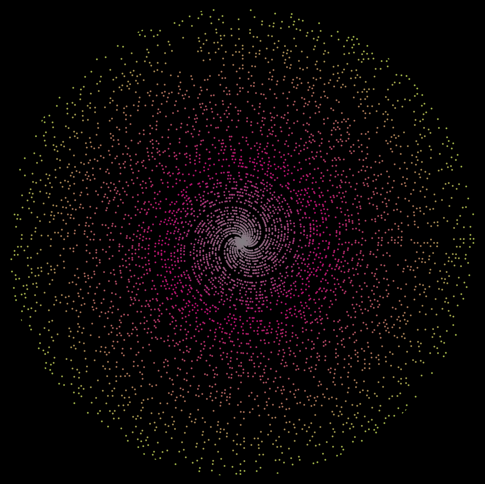
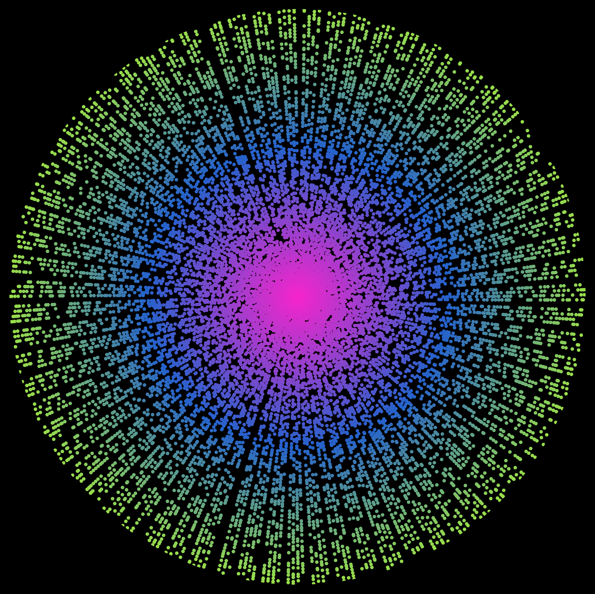
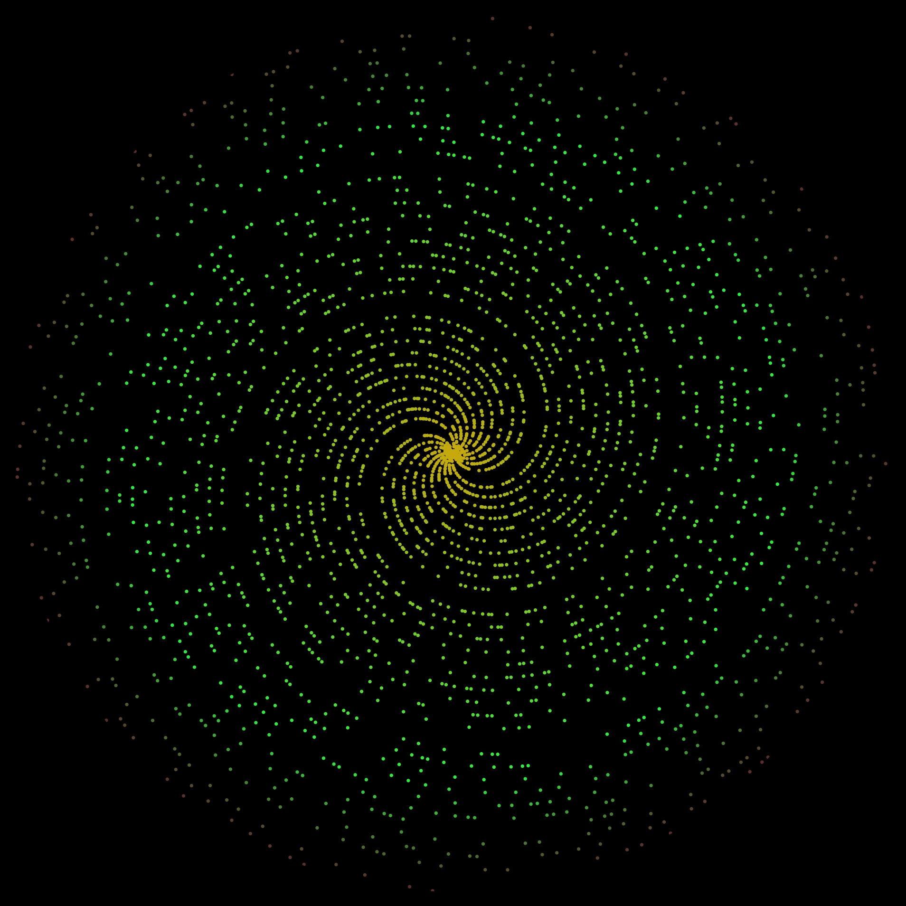
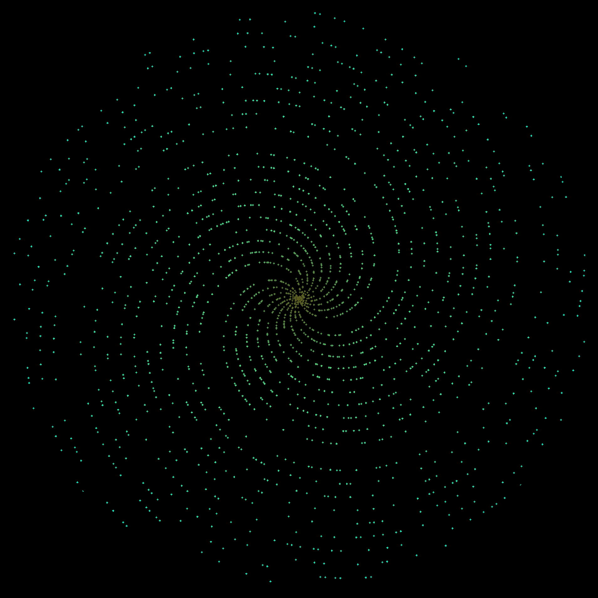
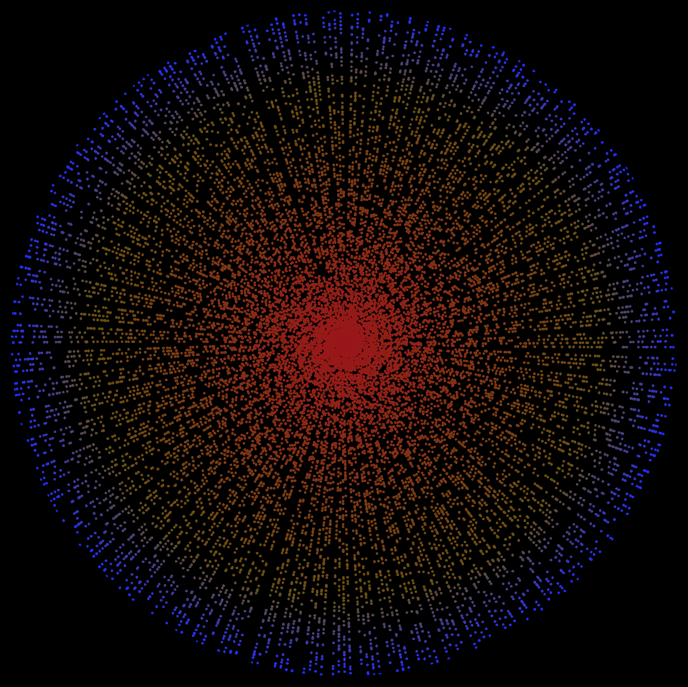
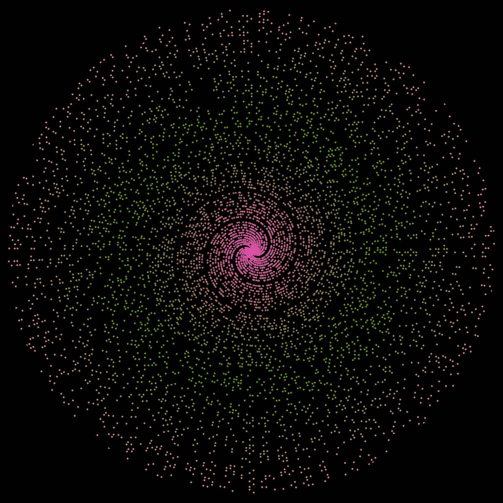

# Prime spiral generator

Generate unique **prime spirals** with Python and `matplotlib`.
The script plots prime numbers with a random colour map onto a grid using polar coordinates.

---

## Sample images

Sample outputs (from the included `sample_images/` folder):

|  |  |  |
| :----------------------------: | :----------------------------: | :----------------------------: |
|        Random spiral #2        |        Random spiral #9        |        Random spiral #12        |

|  |  |  |
| :----------------------------: | :----------------------------: | :----------------------------: |
|        Random spiral #15        |        Random spiral #17        |        Random spiral #19        |

`sample_images/` includes 20 sample images (`0.png` through `19.png`).

---

## Installation

### Requirements

* **Python 3.10+**
* The following libraries:

  ```
  matplotlib
  random
  math
  ```

### Setup

1. Clone this repository:

   ```bash
   git clone https://github.com/ethanwang314159/prime-spiral-generator.git
   cd prime-spiral-generator
   ```
2. Install dependencies:

   ```bash
   pip install matplotlib
   ```

   (`random` and `math` are builtin)

---

## Usage

```bash
python main.py
```

---

## File Structure

```
prime-spiral-generator/
│
├── gen_scripts/
│   ├── next_fp_gen.py         # Finds next available file path in folder
│   ├── ps_plt_gen.py          # Generates prime spiral plot (returns plt)
│   └── rand_settings_gen.py   # Creates random settings
│
├── rand_images/               # Empty (for now)
│
├── sample_images/
│   └── 0.png ... 19.png       # Sample images
│
└── main.py                    # Main script for spiral generation
```

---

## Todo

* **Animation:** visualise growth like the primes getting loaded in (maybe gifs).
* **Interactive UI:** adjust spiral parameters (colours, marker size, number of primes) in a good ui. like change the size by dragging/clicking not typing a number.

---

## License

MIT license.